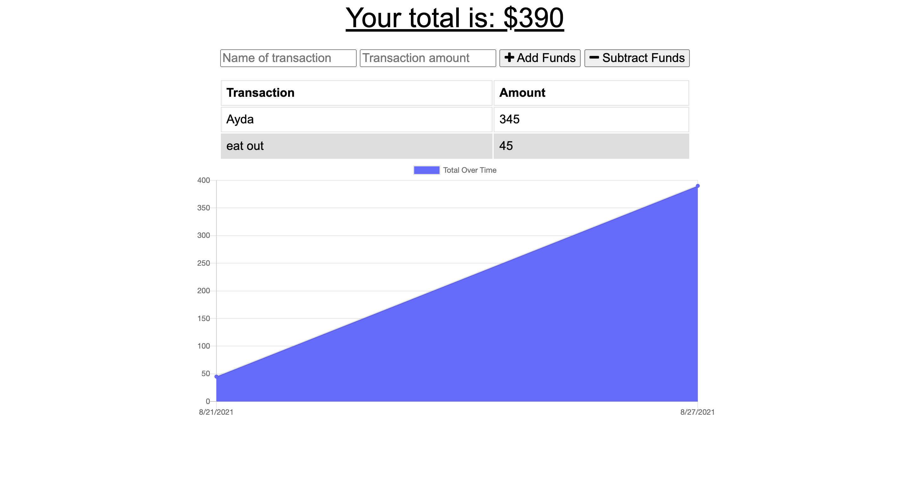

# Progressive Budget Ttracker

# Description 

This is a progressive app that allows user to track thier transactions.

Upon entering the website, user is presented with a form that allows them to enter their transactions 
whether it is to add to their funds or to subtract from them. 

A line graph is displayed below that shows the user their spending habits. 

This application can both work online and offline.

# Links

    * Deployed site: https://guarded-castle-77237.herokuapp.com/
    * Github: https://github.com/aydanegash/progressive-budget-tracker

# License

MIT LICENSE